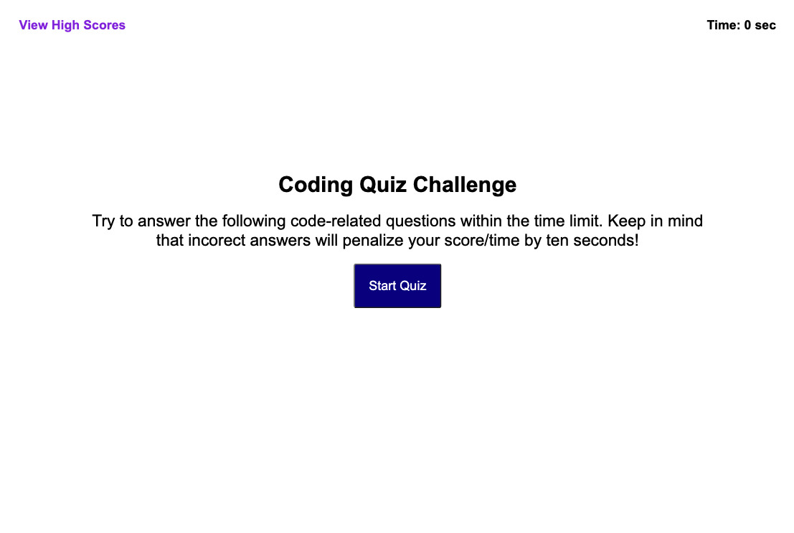

# Module 4 Challenge - Christian Kaikai

## Acceptance Criteria Checklist

- When start button is clicked, the game begins and the timer starts
- When a question is asked it tells the user if they got it correct or not 
- When the answer is incorrect, the background color changes to red
- When the answer is correct, the background color changes to green
- When all questions are answered or the timer reaches 0
- When the game has ended, the user can view previous stats

[View depolyed project here](https://ckaikai19.github.io/lebron/)

---

## Mockup

---
